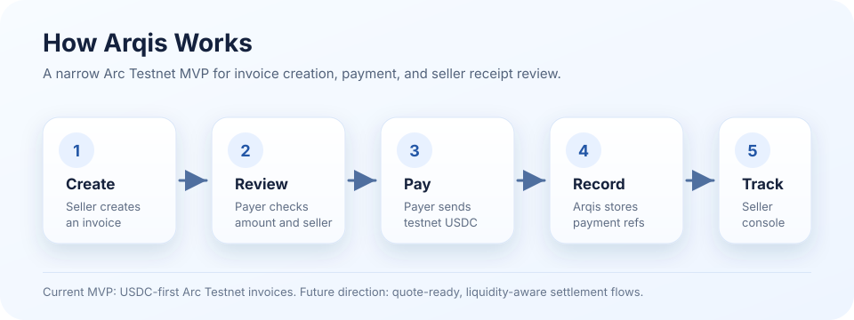
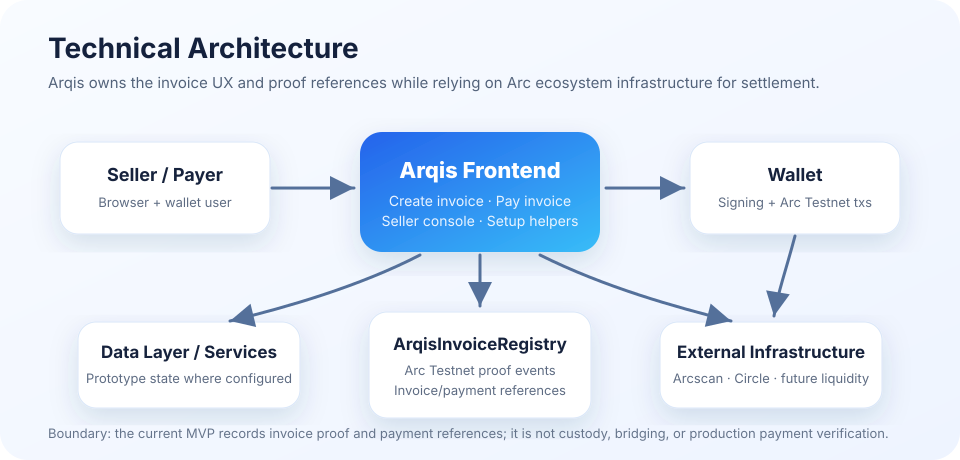

# Arqis

Arqis is a stablecoin-native invoice payment prototype built for Arc Testnet.

Instead of treating invoices as simple payment requests, Arqis focuses on a complete invoice lifecycle—from invoice creation to payment, receipt, and seller tracking.

The current MVP intentionally validates only the core USDC invoice flow. Future versions can build on Arc's liquidity infrastructure to introduce quote previews, liquidity-aware checkout, and more flexible settlement options without changing the core invoice experience.

<p align="center">
  
</p>

## How Arqis Works

```text
Seller creates an invoice
Payer receives and reviews the invoice
Payer pays with Arc Testnet USDC
Arqis records invoice/payment references
Seller reviews status and transaction details
```

Arqis is not trying to become a swap engine or custody layer. The app owns the invoice, checkout, receipt, and seller-console experience. Arc infrastructure can later power quote-ready payment routes and liquidity-aware settlement.

## Current MVP

The prototype currently centers on four app sections:

1. **Create Invoice** — a seller creates a simple invoice for another registered Arqis testnet user.
2. **Pay Invoice** — the payer reviews the invoice and submits a testnet USDC payment.
3. **Seller Console** — the seller tracks invoice status, payment references, and transaction details.
4. **Circle Faucet / Setup** — setup helper for getting Arc Testnet USDC and preparing a wallet.

The MVP is built to validate whether the invoice flow is understandable before expanding into richer payment routing.

## Current Scope / Boundaries

Current scope:

- Arc Testnet only.
- USDC-first invoice flow.
- Client-side prototype UX.
- App-owned invoice registry proof events and payment-reference records.
- Seller and payer flows for product validation.

Current boundaries:

- Not production payment verification.
- Not a custody contract.
- Not a swap engine.
- Not a bridge.
- Not automated settlement operations.
- Not a replacement for Circle, USDC, CCTP, Arcscan, or Arc ecosystem liquidity infrastructure.

## Research & Future Direction

Arqis is positioned for stablecoin-native B2B payments on Arc. Future work can explore:

- **Quote-ready invoices** — show the payer a settlement preview before payment.
- **Liquidity-aware checkout** — make funding and settlement expectations clear before confirmation.
- **Multi-asset payer routing** — allow payers to fund from supported Arc assets while sellers receive their preferred settlement asset.
- **Route transparency** — display route, fees, and expected output before payment.
- **Production APIs** — support programmatic invoice creation, status updates, and reconciliation.
- **Automated settlement operations** — move from manual/testnet references toward production-grade settlement and verification.

## Requirements

- Node.js 20+ recommended.
- npm.
- A browser wallet configured for Arc Testnet.
- Arc Testnet USDC for testing.
- Optional: Supabase/project environment variables if testing connected data flows.

## Open Locally

Install dependencies if needed:

```bash
npm install
```

Run the local dev server:

```bash
npm run dev
```

Then open the local URL printed by the dev server.

For a static-only review, you can also open:

```text
index.html
```

Or serve the folder with any local static server and open:

```text
http://127.0.0.1:8787/index.html
```

## npm Scripts

```text
npm run dev                  Start the local static/dev server
npm run compile              Compile Hardhat contracts
npm run test                 Run Hardhat tests
npm run deploy:arc-testnet   Deploy the Arqis registry contract to Arc Testnet
npm run spike:swap:estimate  Run the Arc App Kit swap estimate spike
npm run spike:swap:execute   Run the Arc App Kit swap execution spike
npm run build:swap           Build swap-related client assets
```

## Repository Structure

```text
.
├── index.html
├── assets/
│   └── readme/
│       ├── product-flow.svg
│       └── architecture.svg
├── contracts/
├── docs/
├── scripts/
├── test/
├── hardhat.config.js
├── package.json
└── README.md
```

## Current Status

This is a testnet prototype. Some docs, screens, and examples may be placeholders for product review. Live wallet balances and transaction rows depend on the connected wallet, Arc Testnet, Arcscan, and any configured backend/data services.

Quote-ready and liquidity-aware flows are product direction notes. The current MVP does not claim to perform live swaps, bridge assets, custody funds, or execute automated payment routing.

## Technical Architecture

<p align="center">
  
</p>

At a high level, Arqis separates the product UX from the infrastructure it depends on:

- **Frontend app** — invoice creation, payer checkout, seller console, and setup helpers.
- **Wallet / Arc Testnet** — user signing, testnet USDC transfers, and transaction submission.
- **ArqisInvoiceRegistry** — app-owned testnet proof contract for invoice/payment-reference events.
- **Data layer / services** — prototype storage and operational state where configured.
- **External explorers and infrastructure** — Arcscan, Circle/USDC tooling, and future Arc liquidity integrations.

## Arc Testnet Contract Proof

Arqis has an app-owned Arc Testnet contract for provenance and lightweight invoice/payment-reference proof.

```text
Contract: ArqisInvoiceRegistry
Address: 0xd04532EBb554ef00A166355a9c1145Ad53B85780
Network: Arc Testnet
Chain ID: 5042002
Deployer / project owner: 0xB1f9eE64333564050964241688899166307d446e
Deployment tx: 0xb69585b7ea314ed13206b1cf75265126a69221561af225c1a4a9309c407ccecd
Example createInvoice tx: 0x3a46fac6c204ee75fac379c9e9569eddfa8f7ff8e48b979fe52818c7f35366d0
```

This contract is not a custody contract, swap engine, bridge, or replacement for USDC/CCTP infrastructure. It records app-specific Arqis invoice proof events and payment transaction references for the testnet MVP. Full production payment verification is planned separately.

## Documentation

- [Overview](docs/overview.md)
- [Product Flow](docs/product-flow.md)
- [MVP Sections](docs/mvp-sections.md)
- [Arc Testnet Setup](docs/arc-testnet-setup.md)
- [Arc Testnet Registry](docs/arc-testnet-registry.html)
- [Future Roadmap](docs/future-roadmap.md)
